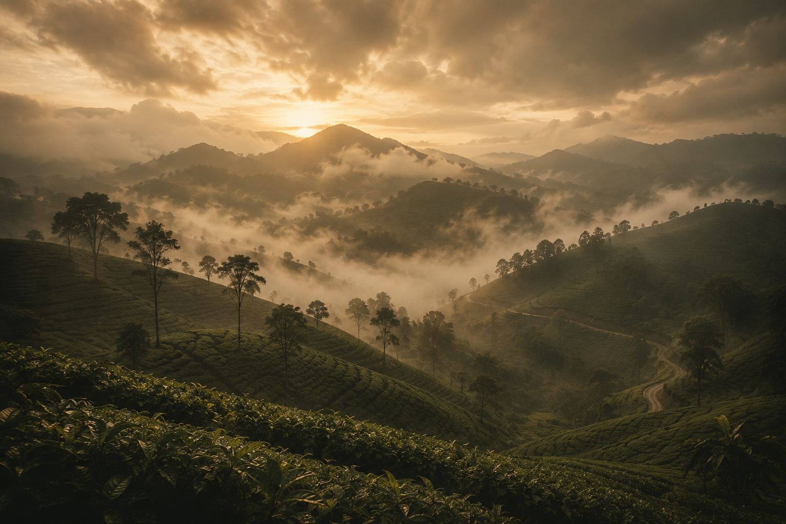
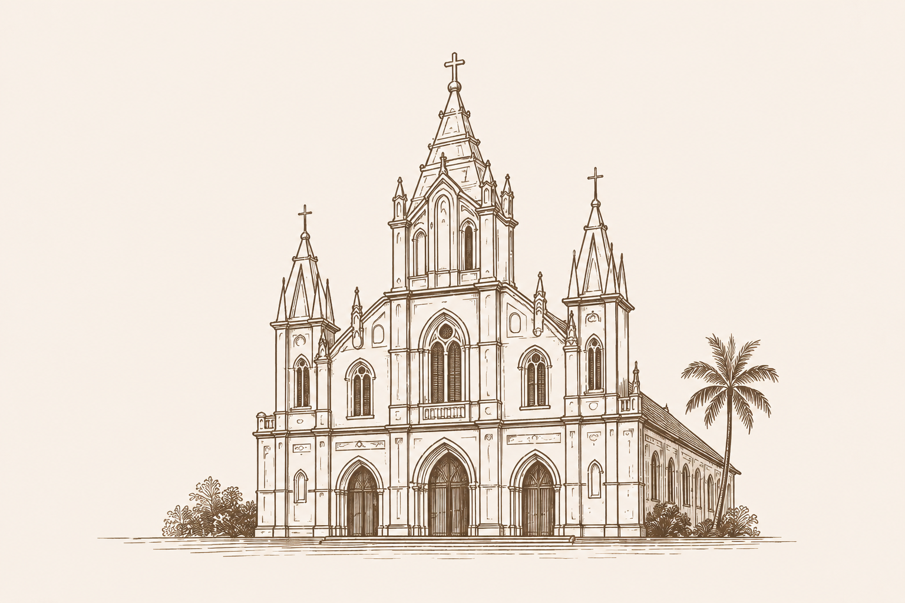
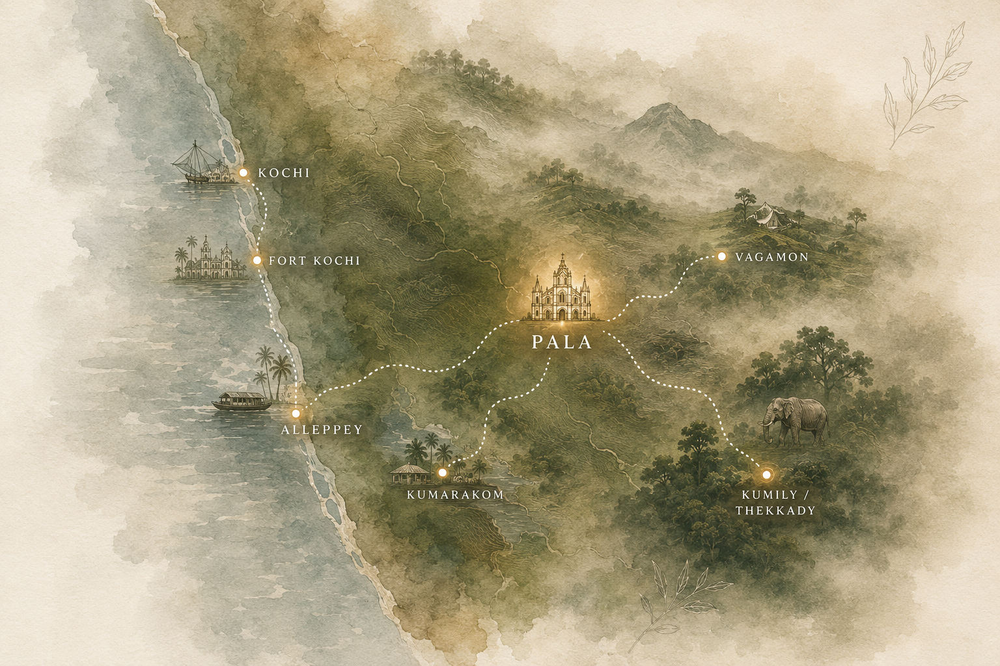

# Image Assets

## Required Images for Wedding Website

Please place the following 3 images in this directory:

1. **hero-kerala-mountains.jpg** (or .png)
   - The Kerala monsoon tea plantation landscape
   - Used as: Hero section background

2. **kerala-journey-map.jpg** (or .png)
   - The watercolor map with all Kerala locations
   - Used as: Journey/Map section

3. **cathedral-illustration.jpg** (or .png)
   - The St. Thomas Cathedral Church line art
   - Used as: Events section wedding ceremony card

## File Naming:
- Use lowercase
- Use hyphens for spaces
- Acceptable formats: .jpg, .jpeg, .png, .webp

## Once placed:
Let Cline know the files are ready, and the components will be updated automatically!
  